# Memory

## Chrome Task Manager
- In Chrome go to the main menu → More tools → Task manager → Right-click on the table header and enable JavaScript memory if not enabled already:

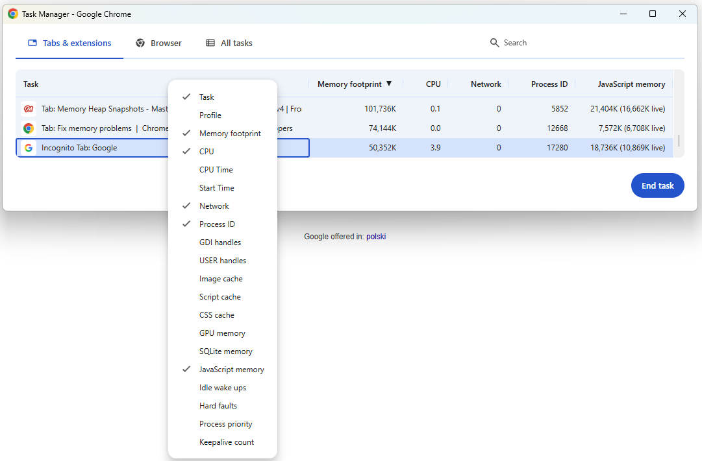

- You're interested in the "live" number in parentheses:

> The first number is how much memory is reserved for JavaScript VM heap, the "live" number is how much memory live (reachable) objects comprise.
> **You should worry about the second one, as the first is derived from the second by V8 memory manager.**

https://groups.google.com/g/google-chrome-developer-tools/c/aTMVGoNM0VY

> If this number is increasing, either new objects are being created, or the existing objects are growing.

https://developer.chrome.com/docs/devtools/memory-problems#monitor_memory_use_in_realtime_with_the_chrome_task_manager

## Performance Panel
- A performance trace (described in more detail [here](./performance.md)) can be recorded with the "Memory" option checked - it will then keep track of memory usage over time as well:

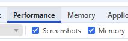

- a stairs-like memory graph suggests a potential memory leak (see more in the [example](#performance-panel---memory-graph) below)

## Memory Panel
- Allows you to capture heap snapshots at different points in time and compare them
- Heap snapshots usually point you to retained objects and reference paths, not directly to the source line that created them
- It can be used for investigating memory leaks in Node.js applications (e.g. web servers) as well - see [Section 7](../../section_7_nodejs_memory_leaks/notes/README.md)
- Displays both shallow and retained size of objects

### Shallow vs Retained Size
> **Shallow size**
>
> This is the size of memory that is held by the object itself.

[Source](https://developer.chrome.com/docs/devtools/memory-problems/get-started#shallow_size)

> **Retained size**
>
> This is the size of memory that is freed once the object itself is deleted along with its dependent objects that were made unreachable from GC roots.

[Source](https://developer.chrome.com/docs/devtools/memory-problems/get-started#retained_size)

So retained size measures memory that could be freed if that object became unreachable, including objects only reachable through it

## Example 1
### Chrome Task Manager - JavaScript Memory
- Open [the demo page](../examples/memory/index.html) in the browser (using the `file` protocol is enough)
- Open Chrome Task Manager and keep an eye on the `live` value in the `JavaScript memory` column
- Click:
  - `Create search data`
  - `Create filter data`
  - `Create form data`
- Each button creates a different accidental global variable (`window.searchData`, `window.filterData`, `window.formData`) that stores a large array
- The `live` value should increase after each button click, because the arrays are still reachable from `window`
- Click `Clear globals`
- The `live` value should eventually drop, but not necessarily immediately - deleting references only makes the data eligible for garbage collection; Chrome/V8 decides when to actually run GC
- To force cleanup, go to DevTools → `Performance` and click the brush icon (`Collect garbage`):

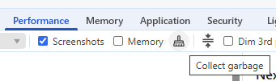

- The Task Manager `live` value may drop a few seconds later
- This is only a debugging tool - in real apps, garbage collection timing is controlled by the browser

### Performance Panel - Memory Graph
- The same scenario can be recorded in DevTools → `Performance` with the `Memory` checkbox enabled
- In the leaky version, clicking the `Create * data` buttons should produce a stairs-like graph:
  - memory goes up after each allocation
  - memory does not go back down, because the arrays are still reachable from accidental globals

- After clicking `Clear globals` and then `Collect garbage`, the graph should drop, because the arrays are no longer reachable:

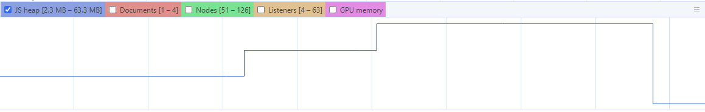

- To show the fix, add the missing `const` keywords in the demo page's script:

```js
const searchData = createLargeNumberArray(1);
const filterData = createLargeNumberArray(2);
const formData = createLargeNumberArray(3);
```

- In the fixed version, the arrays are local to the click handlers
- After each handler finishes, the arrays are no longer reachable, so they can be garbage collected
- The memory graph should rise during the allocations and then drop instead of forming a staircase

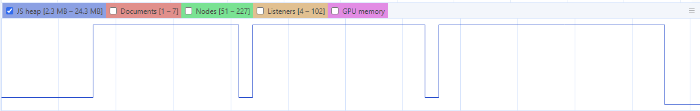

### Memory Panel
- Visit [the demo page](../examples/memory/index.html) once again, this time with the Memory Panel open:

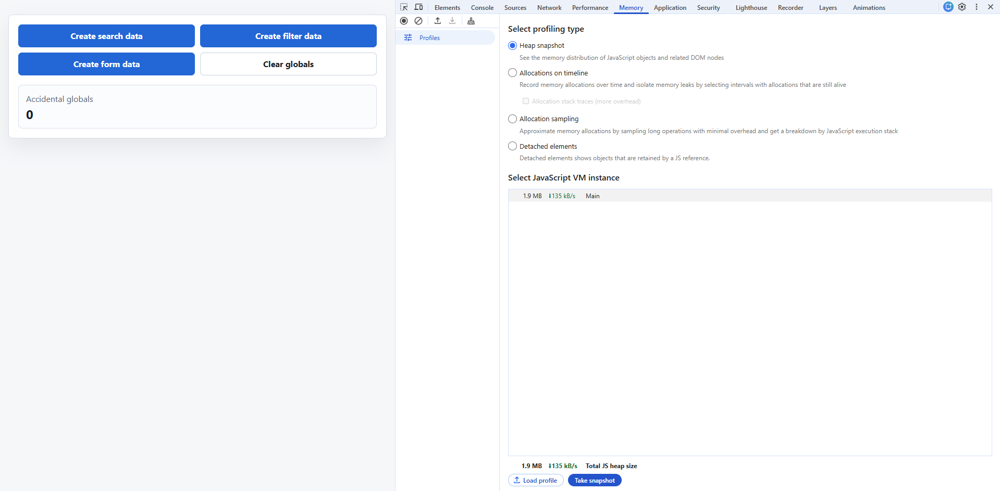

- Click the record button to take a heap snapshot:

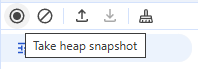

- Once it's ready, click the `Create * data` buttons
- Record a second snapshot
- You should see ~3*20 MB = 60 MB difference between them:

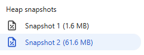

- With the second snapshot selected, select "Comparison" to compare it with snapshot 1, then sort the results by "Size Delta":

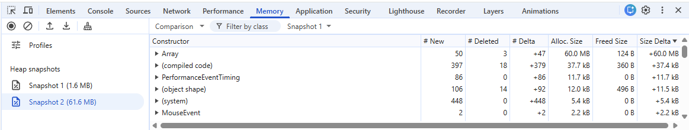

- Click on one of the Array objects with 20,000 kB allocated size and you should see the names `formData`, `searchData`, `filterData` in the object's details:

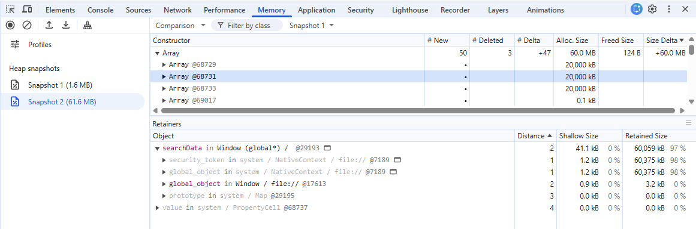

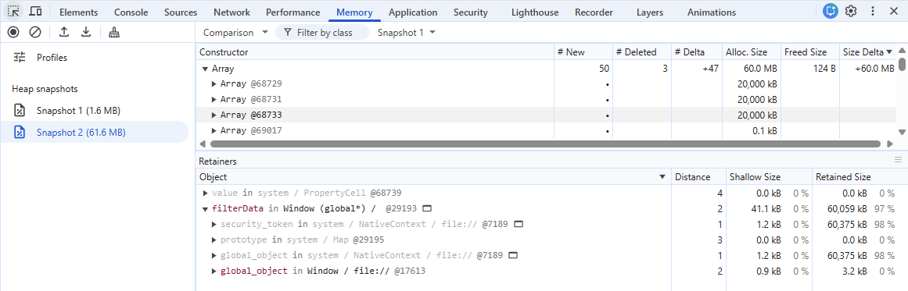

#### Note: `filterData in Window`
- In the Object details, a label like `filterData in Window (global*)` describes the retaining path to the selected array
- It means the array is reachable through a property on the global `window` object:

```text
Window
  -> filterData
    -> Array
```

- The sizes shown for the `Window` row belong to the `Window` object, not just to the selected `filterData` array
- `Window` has a small shallow size, but its retained size can be much larger because it keeps multiple large accidental globals reachable (`searchData`, `filterData`, `formData`)
- This is why the array row can show ~20 MB, while the top-level `Window` row can show ~60 MB retained size

## Example 2
You can also perform similar tests at https://masteringdevtools.com/lesson/memory, e.g. after creating a large number of `div` elements:

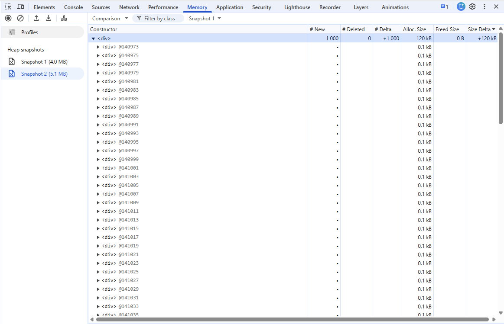
