# Network

## Request Blocking
Request blocking makes matching requests fail before they receive a response. It is useful for testing missing scripts, blocked API calls, or other cases where the browser cannot reach a resource.

To block a request from the Network tab:
1. Right click a request
2. Select `Block request URL` or `Block request domain`
3. Reload the page or trigger the request again

Blocked requests can be filtered in the Network tab with `More filters` → `Blocked requests`:

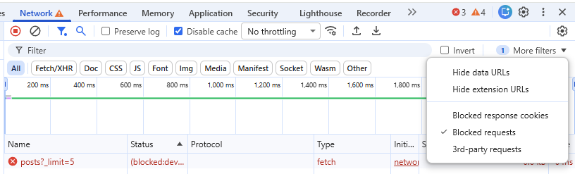

## Throttling
Network throttling simulates slower network conditions. The Network tab has built-in presets such as `Fast 3G` and `Slow 3G`. For more specific tests, custom profiles can be created with custom values for:
- download speed
- upload speed
- latency

Starting with version 145 ([stable release date: February 10th, 2026](https://developer.chrome.com/release-notes/145)), Chrome supports [individual network request throttling](https://developer.chrome.com/blog/new-in-devtools-144?hl=en#request-conditions) by default.

## Request conditions
The `Request conditions` drawer allows you to:
- add, remove, and edit URL patterns - also using wildcards (`*`),
- modify throttling settings - using presets (like `Fast 4G` or `Slow 4G`) and custom profiles
- enable and disable individual patterns, or all patterns at once
- reorder patterns with arrow buttons - "If a request matches multiple patterns, DevTools applies the first rule found" ([source](https://developer.chrome.com/docs/devtools/request-conditions#reorder_url_matching_patterns))

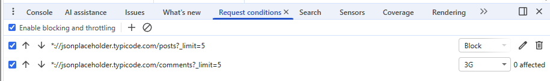

The drawer opens automatically after a request is blocked or throttled from the Network tab:

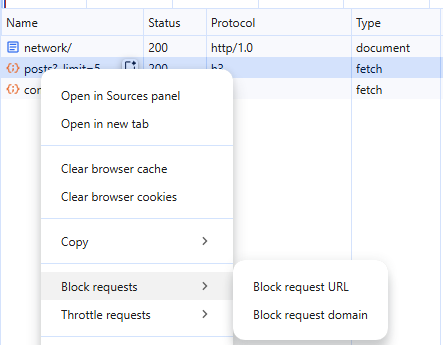

To open it manually:
- If needed, open the console drawer by clicking  `Esc` or options (`Customize and control DevTools`) → `Show console drawer`:

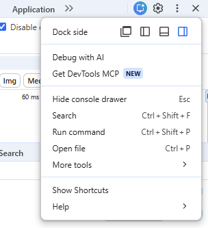

- Select `Request conditions` from options (`More Tools`) menu if not visible:

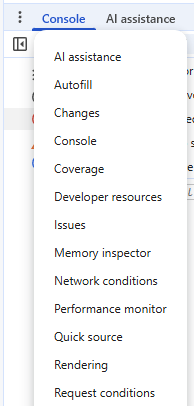

## Local Overrides
- Network → select request → right click → override content
- Edit response in `Sources` → `Overrides`
- Enable / disable: `Sources` → `Overrides` → check / uncheck `Local Overrides`

## Network Tab Warning

A warning icon with more details on hover will be displayed in the Network tab's title if requests are potentially affected by local overrides or throttling patterns:

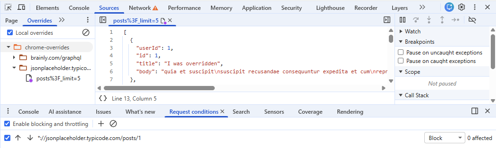

## Custom Network Throttling Profile Updates
### Problem
DevTools snapshots the profile values at the moment the profile is selected/enabled. Editing the profile definition while it's active does not trigger a re-application of the new values.

### Workarounds
1. Toggle the throttling off and back on - uncheck and re-check the throttling pattern in the "Request conditions" drawer
2. Switch profiles - select a different profile (or "No throttling") and then switch back to the edited one
3. Close and reopen DevTools

## Blocking vs Returning an Error Status Code
**Blocking a request** (via DevTools or network failure) means the request never gets a response. The browser throws a network error:
- `fetch` - the promise rejects with a `TypeError`
- `axios` - the promise rejects, and `error.response` is undefined
- real-world equivalent: DNS failure, unreachable server, CORS block, user being offline

Returning an error status code means the request got a valid HTTP response, just with an error status:
- `fetch` - the promise resolves (you must check `response.ok` or `response.status`)
- `axios` - the promise rejects for non-2xx responses by default ([source](https://axios.rest/pages/advanced/response-schema#checking-the-status-code)), but `error.response` contains the full status, headers, and body
- real-world equivalent: server returned an error

Most apps handle each case separately - e.g., a 401 triggers a login redirect, a 403 shows "access denied", a 500 shows a generic error toast, and a network failure shows "check your connection".

## Network messages
Chrome DevTools may still print a red console message for an HTTP error status:

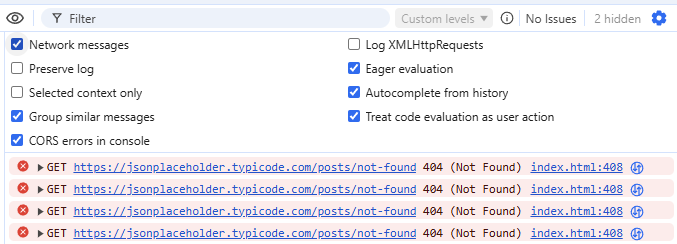

These messages are controlled by the Console settings checkbox `Network messages`. They do not mean that `fetch` rejected.

## Simulating a Delayed Failure
Chrome DevTools does not natively support simulating a request that stays pending for a configurable time and then fails. The workarounds to simulate this scenario are:
### Chrome extensions
[ModResponse](https://chromewebstore.google.com/detail/modresponse-mock-and-repl/bbjcdpjihbfmkgikdkplcalfebgcjjpm) allows adding a configurable delay and returning a custom HTTP status code for specific URLs. May not be an option due to safety concerns related to the required permissions (especially on corporate machines):

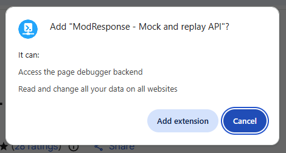

See also: [108 Malicious Chrome Extensions Steal Google and Telegram Data, Affecting 20,000 Users](https://thehackernews.com/2026/04/108-malicious-chrome-extensions-steal.html) [Apr 14, 2026]

### Custom Service Worker
A service worker can intercept matching requests and return a delayed error response.

An example worker is available in [`../examples/network/mock-sw.js`](../examples/network/mock-sw.js). The comment at the top of that file explains how to configure URL matching rules and how to unregister the worker when the demo is finished.

The worker will not run from the `file://` protocol, so the example page needs to be served over HTTP. On Windows, one simple option is to run this from the `section_15_chrome_dev_tools` directory:

```bash
python -m http.server 8000
```

Then open `http://localhost:8000/examples/network/`.

Register the worker from the DevTools Console:

```js
navigator.serviceWorker.register('/examples/network/mock-sw.js');
```

After registration, reload the page if Chrome says the page is not controlled by the service worker yet.

In DevTools, go to `Application` → `Service workers`. The `Network requests` button opens the Network tab with the `is:service-worker-intercepted` filter applied, which makes it easier to inspect only the requests handled by the worker.

#### Filtering Intercepted Requests

Requests intercepted by a service worker can be filtered in the Network tab with:

```text
is:service-worker-intercepted
```

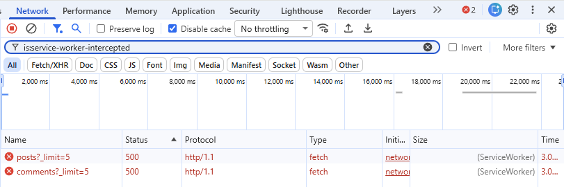

The `Network requests` button in `Application` → `Service workers` applies this filter automatically:

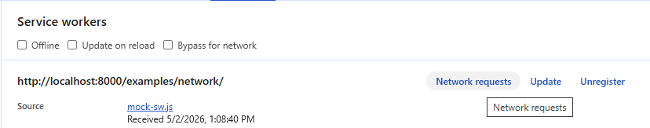

You can read more about filtering requests in general at https://devtoolstips.org/tips/en/filter-network-requests/

#### Hard Reload Bypasses Service Workers

Hard reload / "empty cache and hard reload" bypasses the service worker entirely. On Windows, examples include `Ctrl+F5`, `Ctrl+Shift+R`, or `Ctrl` + reload button. Requests made during a hard reload are not intercepted by the worker:

> If you force-reload the page (shift-reload) it bypasses the service worker entirely.

https://web.dev/articles/service-worker-lifecycle#shift-reload

When testing with `mock-sw.js`, always use a normal reload (`F5`, `Ctrl+R` or the reload button).

#### Service Worker Works Without DevTools Open

Unlike DevTools' built-in throttling and request blocking (which are disabled when DevTools is closed), a service worker runs independently of DevTools after it has been registered.

#### Reload The Page After Unregistering the Worker
After unregistering the service worker - either by using the "Unregister" button in `Application` → `Service workers`:

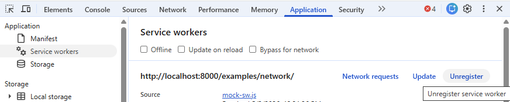

or executing:
```js
navigator.serviceWorker.getRegistration('/examples/network/mock-sw.js').then(r => r.unregister())
```
in the console, you need to reload the page. Otherwise the requests will still be intercepted.

#### DevTools vs Service Worker - Summary

| Feature | DevTools throttling / blocking | Service worker |
| --- | --- | --- |
| Requires DevTools to stay open | Yes | No, after registration |
| Return custom HTTP status codes | No | Yes |
| Add a delay before returning an error | No | Yes |
| URL matching | URL patterns with wildcards (`*`), not regex | JavaScript logic, including regex |
| Affected by hard reload | No | Yes |
| Requires reload after disabling | No | Yes |

---
Sources:
- https://developer.chrome.com/docs/devtools/settings/throttling
- https://developer.chrome.com/docs/devtools/request-conditions
- https://developer.chrome.com/docs/devtools/overrides
