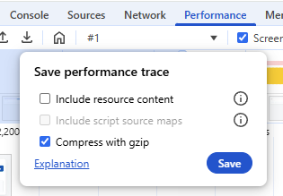
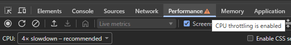
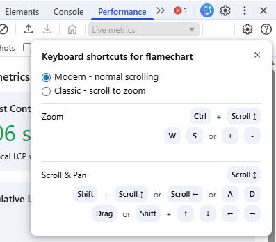
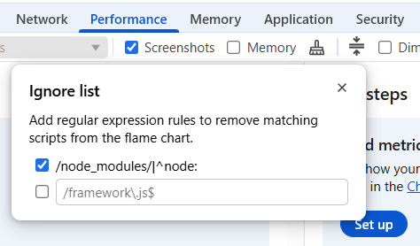
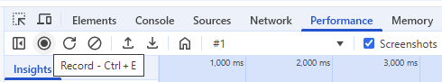
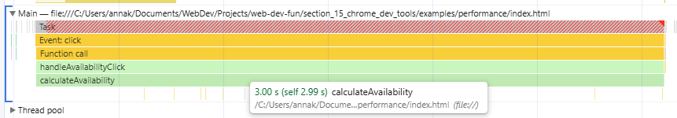
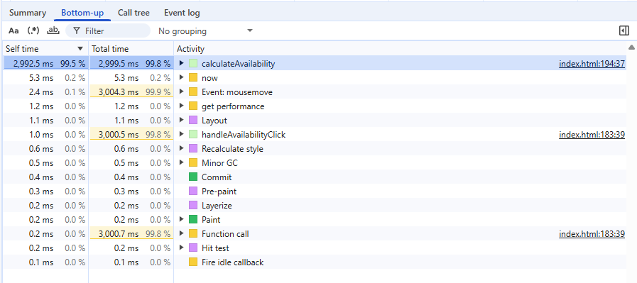

# Performance
## General Notes
- Some browser extensions can affect performance recordings - it's better to use incognito mode
- Performance traces are standardized files that can be downloaded and shared (see more at https://developer.chrome.com/docs/devtools/performance/save-trace):

- For measuring JavaScript code's performance programmatically, the [Performance](https://developer.mozilla.org/en-US/docs/Web/API/Performance) API is more appropriate than `Date` objects:
> Note: In browsers that support the [Performance API](https://developer.mozilla.org/en-US/docs/Web/API/Performance_API)'s high-resolution time feature, `Performance.now()` can provide more reliable and precise measurements of elapsed time than `Date.now()`.

https://developer.mozilla.org/en-US/docs/Web/JavaScript/Reference/Global_Objects/Date

## CPU throttling
- Use [CPU throttling](https://developer.chrome.com/docs/devtools/settings/throttling) to simulate low- and mid-tier devices
- When you do, the Performance tab will contain a warning that "CPU throttling is enabled":

- You can compare how smooth the animations with and without CPU throttling are at:
  - https://googlechrome.github.io/devtools-samples/jank/ ([source](https://developer.chrome.com/docs/devtools/performance))
  - https://masteringdevtools.com/exercise/thrashing ([source](https://frontendmasters.com/courses/dev-tools-v4/performance-profiling-exercise/))

## Navigation
You can choose between modern and classic keyboard shortcuts for the performance flamecharts:

## Self vs total time
> - Self time — How long it took to complete the current invocation of the function, including only the statements in the function itself, not including any functions that it called.
> - Total time — The time it took to complete the current invocation of this function and any functions that it called.

https://developer.chrome.com/blog/devtools-revolutions-2013#flame_chart_visualization_for_javascript_profiles

## Ignore List

You can configure third-party scripts (e.g. from Google Tag Manager) to be ignored and not appear in the flamechart:

## Example
- Open [the demo page](../examples/performance/index.html) in the browser (using the `file` protocol is enough)
- Go to DevTools → Performance → start recording:

- Type something in the text input → click "Calculate availability" → try to type something in the input again and notice how the UI freezes
- Once the second text appears in the input, stop the recording

### Analyze the result
- Use the Main track to view activity that occurred on the page's main thread ([source](https://developer.chrome.com/docs/devtools/performance/reference#main)):

- Width (x-axis) - how long it took
- Depth (y-axis) - call stack
- You wanna focus on the last wide one (i.e. the one with a large self time, and none of its children having a large self time) - `calculateAvailability` in this case
- You can also go to the Bottom-up tab to sort activities by their self and total time:

