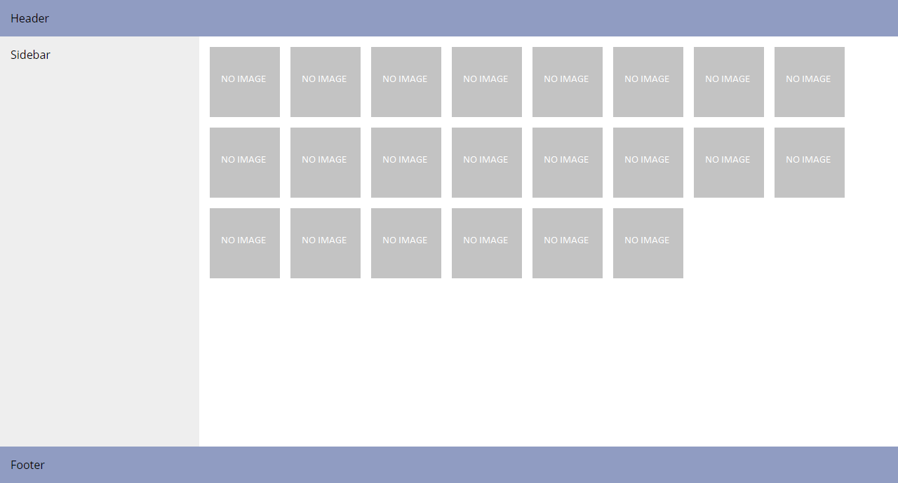
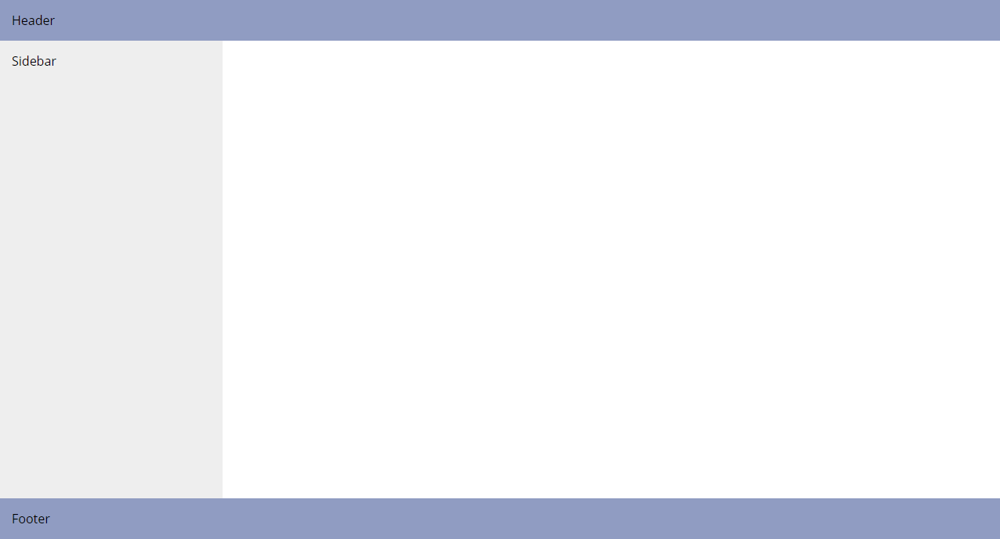
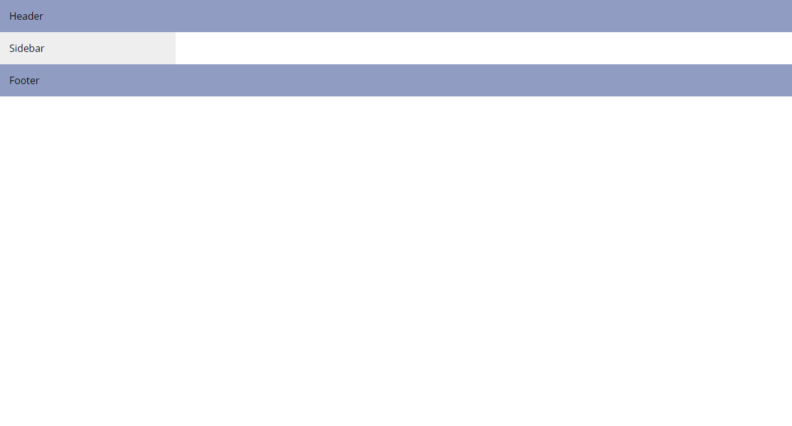
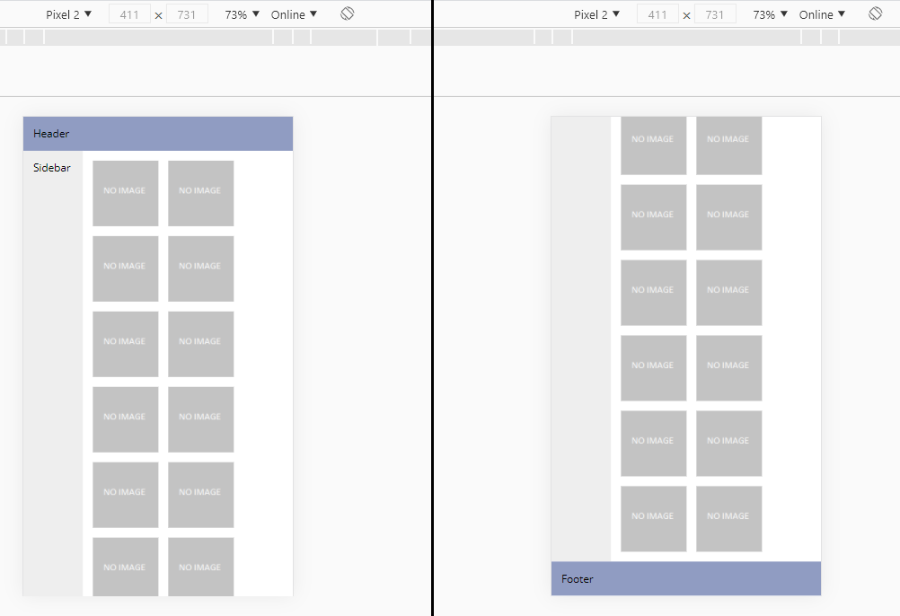

# Section 5. CSS flexbox and grid

## Description
Use the `photo-gallery-boilerplate.html` file to create the following page layout:

Use flex and grid layouts where appropriate.

## Details
- Each main area (header, footer, content, sidebar) has a padding of 15 px.
- There is a 15px gap between photos in the gallery.
- Header's and footer's height is determined by their content.
- The content area is 3.5 times wider than the sidebar.
- If a new photo doesn't fit in the existing line, it should be pushed to the start of a new line.
- Main areas' background colors are as follows:
  - header, footer - #909cc2
  - content - #fff
  - sidebar - #eee
- The whole page should always fill the whole viewport height. This means that if there are no photos in the gallery, the page should look like this:

  

  and not like this:

  

  Moreover, the page should be scrollable if there is too much content to fit in one viewport:

  

- Hints:
  - make use of CSS `min-height` property and viewport units (`vh`),
  - find a keyword that lets you make grid's row's height fit its content.

