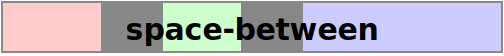
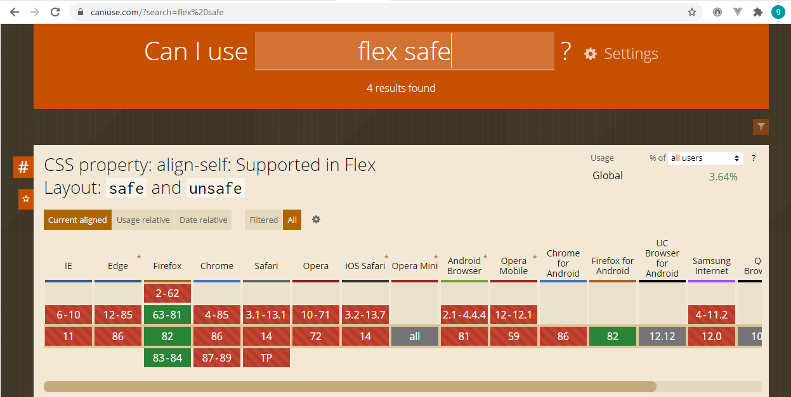
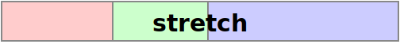

# CSS Flexbox
## Basics and Terminology
- > A **flex container** is the box generated by an element with a computed display of flex or inline-flex. In-flow children of a flex container are called **flex items** and are laid out using the flex layout model.

  [Source](https://www.w3.org/TR/css-flexbox-1/)

- > The main idea behind the flex layout is to give the container the ability to alter its items’ width/height (and order) to best fill the available space (mostly to accommodate to all kind of display devices and screen sizes). A flex container expands items to fill available free space or shrinks them to prevent overflow.
  > (...)
  > Note: Flexbox layout is most appropriate to the components of an application, and small-scale layouts, while the Grid layout is intended for larger scale layouts.

  [Source](https://css-tricks.com/snippets/css/a-guide-to-flexbox/)

### Flex Layout Box Model

*Source: https://www.w3.org/TR/css-flexbox-1/images/flex-direction-terms.svg*

- The **main axis** of a flex container is the primary axis along which flex items are laid out. It extends in the **main dimension**.
- The axis perpendicular to the main axis is called the **cross axis**. It extends in the **cross dimension**.
- The width or height of a flex container or flex item, whichever is in the main dimension, is that box’s **main size**.
- The width or height of a flex container or flex item, whichever is in the cross dimension, is that box’s **cross size**.
- The flex items are placed within the container starting on the **main-start** side and going toward the **main-end** side.
- [Flex lines](#flex-lines) are filled with items and placed into the container starting on the **cross-start** side of the flex container and going toward the **cross-end** side.

[Source](https://www.w3.org/TR/css-flexbox-1/#box-model)

### Flex lines
> Flex items in a flex container are laid out and aligned within flex lines, hypothetical containers used for grouping and alignment by the layout algorithm. A flex container can be either single-line or multi-line, depending on the flex-wrap property (...).

[Source](https://www.w3.org/TR/css-flexbox-1/#flex-line)

## CSS properties
### Flex container properties
- `display`:
  - > defines a flex container; inline or block depending on the given value.

    [Source](https://css-tricks.com/snippets/css/a-guide-to-flexbox/)

  - values: 
    - `flex`:
      > The element we've given a   display value of flex to is acting like a block-level element in terms of how it interacts with the rest of the page (...).

      [Source](https://developer.mozilla.org/en-US/docs/Learn/CSS/CSS_layout/Flexbox)
    - `inline-flex`:
      - does not force a new line to begin in the document flow
      - respects `width` and `height` properties values
      - respects `margin` and `padding` and pushes other elements away both horizontally and vertically

- `flex-direction`:
  - > The `flex-direction` property specifies how flex items are placed in the flex container, by setting the direction of the flex container’s main axis.

    [Source](https://www.w3.org/TR/css-flexbox-1/#flex-direction-property)
  
  - values:
    - `row` (default) - left to right in `ltr`, right to left in `rtl`. See the [note](#css-direction-property) about the `direction` property for more details
    - `row-reverse` 
    - `column`
    - `column-reverse`
- `flex-wrap`:
  - > The flex-wrap property controls whether the flex container is single-line or multi-line, and the direction of the cross-axis, which determines the direction new lines are stacked in.
  
  - values:
    - `nowrap` (default) - the flex container is single-line
    - `wrap` - the flex container is multi-line
    - `wrap-reverse` - the flex container is multi-line; the cross-start and cross-end directions are swapped

     [Source](https://www.w3.org/TR/css-flexbox-1/#valdef-display-inline-flex)
- `flex-flow`:
  - > The `flex-flow` property is a shorthand for setting the `flex-direction` and `flex-wrap` properties, which together define the flex container’s main and cross axes.
    >
    > (...)
    > Note that the `flex-flow` directions are writing mode sensitive. In vertical Japanese, for example, a row flex container lays out its contents from top to bottom (...).

  [Source](https://www.w3.org/TR/css-flexbox-1/#flex-flow-property)

    Defaults to `row nowrap`.

    See the [note](#css-writing-mode-property) about the `writing-mode` property for more details.

- `justify-content`:
  - > defines the alignment along the main axis

  [Source](https://css-tricks.com/snippets/css/a-guide-to-flexbox/)
  - popular values:
    - `flex-start` (default):
      >  Aligns the alignment subject to be flush with the edge of the alignment container corresponding to the flex container’s main-start or cross-start side, as appropriate.

      [Source](https://www.w3.org/TR/css-align-3/#positional-values)
    - `flex-end`:
      > Aligns the alignment subject to be flush with the edge of the alignment container corresponding to the flex container’s main-end or cross-end side, as appropriate.

      [Source](https://www.w3.org/TR/css-align-3/#positional-values)
    - `center`:
      > Centers the alignment subject within its alignment container.

      [Source](https://www.w3.org/TR/css-align-3/#positional-values)
    - `space-around`:
    > The alignment subjects are distributed so that the spacing between any two adjacent alignment subjects is the same, and the spacing before the first and after the last alignment subject is half the size of the other spacing.
    >
    > 

    [Source](https://www.w3.org/TR/css-align-3/#distribution-values)
    - `space-between`:
    > The first alignment subject is placed flush with the start edge of the alignment container, the last alignment subject is placed flush with the end edge of the alignment container, and the remaining alignment subjects are distributed so that the spacing between any two adjacent alignment subjects is the same.
    >
    > 

    [Source](https://www.w3.org/TR/css-align-3/#distribution-values)
    - `space-evenly`:
    > The alignment subjects are distributed so that the spacing between any two adjacent alignment subjects, before the first alignment subject, and after the last alignment subject is the same.
    >
    > 

    [Source](https://www.w3.org/TR/css-align-3/#distribution-values)
    
  - > There are also two additional keywords you can pair with these values: safe and unsafe. Using safe ensures that however you do this type of positioning, you can’t push an element such that it renders off-screen (e.g. off the top) in such a way the content can’t be scrolled too (called “data loss”).

    [Source](https://css-tricks.com/snippets/css/a-guide-to-flexbox/)

    This two keywords are currently (22.11.2020) not supported anywhere except for Firefox:
    
  *Source: https://caniuse.com/?search=flex%20safe*
- `align-items`:
  - > This defines the default behavior for how flex items are laid out along the cross axis on the current line.

    [Source](https://css-tricks.com/snippets/css/a-guide-to-flexbox/)
  
  - values:
    - `stretch` (default) 
      > If the combined size of the alignment subjects is less than the size of the alignment container, any auto-sized alignment subjects have their size increased equally (not proportionally), while still respecting the constraints imposed by max-height/max-width (or equivalent functionality), so that the combined size exactly fills the alignment container.
      >
      > 

      [Source](https://www.w3.org/TR/css-align-3/#distribution-values)
    - `flex-start`
    - `start`
    - `self-start`
    - `flex-end`
    - `end`
    - `self-end`
    - `center`
    - `baseline`
- `align-content`
### Flex items properties
- `order`
- `flex-grow`
- `flex-shrink`
- `flex-basis`
- `flex`
- `align-self`
---
## Notes
### CSS `direction` property
> The direction CSS property sets the direction of text, table columns, and horizontal overflow. Use `rtl` for languages written from right to left (like Hebrew or Arabic), and `ltr` for those written from left to right (like English and most other languages).
  >
  > (...)
  >
  > Note that text direction is usually defined within a document (e.g., with HTML's `dir` attribute) rather than through direct use of the direction property.

  [Source](https://developer.mozilla.org/en-US/docs/Web/CSS/direction)

  Example:
  ```html
  <html class="language-ar ua-chrome ua-chrome-86 ua-vn- dev-desktop os-windows user-location-pl" dir="rtl" lang="ar" data-status-code="200" data-triggered="true">
    ...
  </html>
  ```
  [Source: Arabic edition of Goal.com](https://www.goal.com/ar)

### CSS `writing-mode` property
> This property specifies the block flow direction, which is the direction in which block-level containers are stacked, and the direction in which inline-level content flows within a block container. 

  [Source](https://developer.mozilla.org/en-US/docs/Web/CSS/writing-mode)

  Values:
  - `horizontal-tb`
  - `vertical-rl`
  - `vertical-lr`
  - `sideways-rl` - experimental
  - `sideways-lr` - experimental

### 

