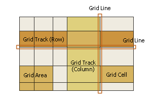

# CSS Grid
## Basics and Terminology

- CSS Grid can be used to create a two-dimensional layout system, optimized for user interface design.
- A **grid container** is an element with `display` property set to `grid` or `inline-grid`. Its children become **grid items**.
- Other important elements:
  - grid line
  - grid cell
  - grid track (grid row or grid column)
  - grid area - defined by an intersection of grid columns and rows

    

    
  *Source: https://www.w3.org/TR/css-grid-1/#grid-concepts*

## CSS properties
### Grid container properties
- `display`:
  - values:
    - `grid`:
      > generates a block-level grid

      [Source](https://css-tricks.com/snippets/css/complete-guide-grid/)
    - `inline-grid`:
      > generates an inline-level grid

      [Source](https://css-tricks.com/snippets/css/complete-guide-grid/)
- `grid-template-columns`, `grid-template-rows`:
  - > Defines the columns and rows of the grid with a space-separated list of values. The values represent the track size, and the space between them represents the grid line.

  [Source](https://css-tricks.com/snippets/css/complete-guide-grid/)

    - values can be defined e.g. with the following units:
      - `fr` - defines a *flexible length*, which represents a fraction of the leftover space in the grid container
      ([Source](https://www.w3.org/TR/css-grid-1/#fr-unit)).
      The free space is calculated after any non-flexible items ([Source](https://css-tricks.com/snippets/css/complete-guide-grid/#fr-unit)).

      - absolute length units, like pixels (`px`)
      - percentage values (see [Flexible (`fr`) vs percentage (`%`) values]( #flexible-fr-vs-percentage-%-values) note for more details)
    - instead of manually defining the same width or height value for multiple columns or rows, you can use the `repeat` function
    - example 1:
      ```css
      .parent {
        display: grid;
        grid-template-columns: repeat(3, 100px);
        ...
      }
      ```
      is equavalent to:
      ```css
      .parent {
        display: grid;
        grid-template-columns: 100px 100px 100px;
        ...
      }
      ```
    - example 2:
      ```css
      .parent {
        display: grid;
        grid-template-columns: 2fr 1fr 3fr 1fr;
        grid-template-rows: repeat(5, 3fr) 1fr;
        ...
      }
      ```

- `grid-template-areas`:
  - > Defines a grid template by referencing the names of the grid areas which are specified with the `grid-area` property. Repeating the name of a grid area causes the content to span those cells. A period signifies an empty cell. The syntax itself provides a visualization of the structure of the grid.

    [Source](https://css-tricks.com/snippets/css/complete-guide-grid/)

  - example:
    ```css
    .parent {
        display: grid;
        grid-template-areas:
          "background-1 ear background-2 background-2"
          "head head background-2 background-2"
          "background-3 neck background-2 background-2"
          "background-3 horse-blanket horse-blanket horse-blanket"
          "background-3 fore-leg background-4 hind-leg"
          "background-3 fore-hoof background-4 hind-hoof";
        ...
      }
      #head {
        grid-area: head;
      }

      #ear {
        grid-area: ear;
      }
      ...
    ```
- `grid-template`:
  - a shorthand property for the following CSS properties:
    - `grid-template-areas`
    - `grid-template-columns`
    - `grid-template-rows`
  - example:
    ```css
    .parent {
      display: grid;
      grid-template:
        "background-1 ear background-2 background-2" 3fr
        "head head background-2 background-2" 3fr
        "background-3 neck background-2 background-2" 3fr
        "background-3 horse-blanket horse-blanket horse-blanket" 3fr
        "background-3 fore-leg background-4 hind-leg" 3fr
        "background-3 fore-hoof background-4 hind-hoof" 1fr
        / 2fr 1fr 3fr 1fr;
      ...
    }
    ``` 
- `column-gap`, `row-gap`:
  - > These properties specify fixed-length gutters between items in the container, adding space between them.

    [Source](https://www.w3.org/TR/css-align-3/#column-row-gap)

  - > The gutters are only created between the columns/rows, not on the outer edges.

    [Source](https://css-tricks.com/snippets/css/complete-guide-grid/)

  - example:
    ```css
    .parent {
      background-color: #5c533d;
      display: grid;
      column-gap: 5px;
      row-gap: 10px;
      ...
    }
    ```

- `grid-column-gap`, `grid-row-gap` - legacy properties that should be treated as aliases for `column-gap` and `row-gap`, respectively
- `gap`, 
`grid-gap`

### Grid items properties
- `grid-column-start`, 
`grid-column-end`, 
`grid-row-start`, 
`grid-row-end`
- `grid-column`, 
`grid-row`
- `grid-area`

## Inspect CSS Grid with Chrome DevTools
@TODO: https://developers.google.com/web/tools/chrome-devtools/css/grid

---
## Notes
### Flexible (`fr`) vs percentage (`%`) values
The differences between `fr` and `%` units are that:
- percentage values should sum up to max 100%. There are no similar restrictions for `fr` values. For example, if you had 4 columns of equal width defined like this:
  ```css
  grid-template-columns: 25% 25% 25% 25%;
  ```
  and wanted to add another one, you'd have to redefine values for all the columns to 20%. With `fr`, you could just add another value of `1fr`.
- Unline `%`, values expressed in `fr` are calculated as a fraction of the *leftover space* (i.e. *the space to fill minus the base sizes of the non-flexible grid tracks.* - [source](https://www.w3.org/TR/css-grid-1/#leftover-space)). 

### Grid container's with
If `display` is set to `grid` for a grid container, then the container takes up all the available horizontal space by default. 
This means that with a rule like this:
```css
.parent {
  display: grid;
  grid-template-columns: 1fr 1fr 1fr;
}
```
 every column of the `.parent` element will occupy 1/3 of the available space.

With `display` set to `inline-grid`, the container's width will depend on its  and its descendants content, padding, border and margin. If none of them is set, you may need to define grid container (or its children) width explicitly - otherwise it will be 0.
