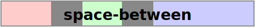
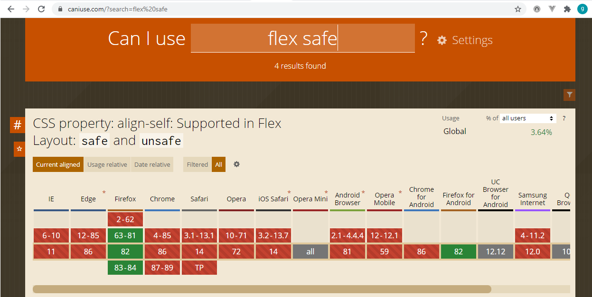
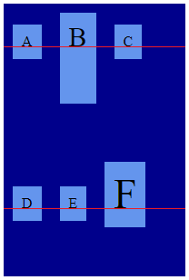
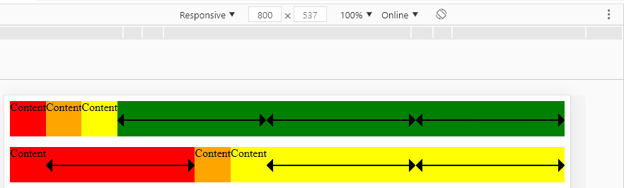
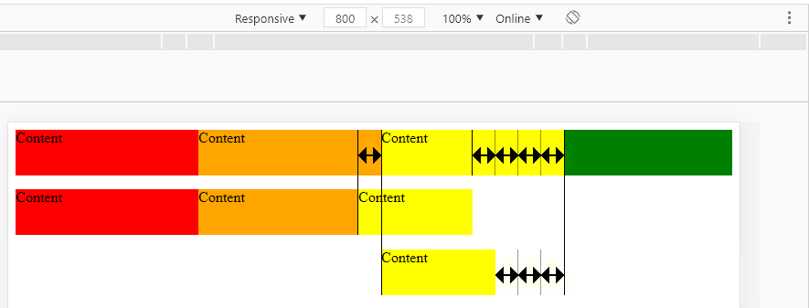
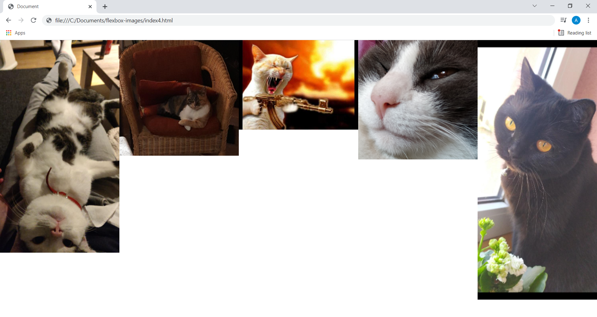
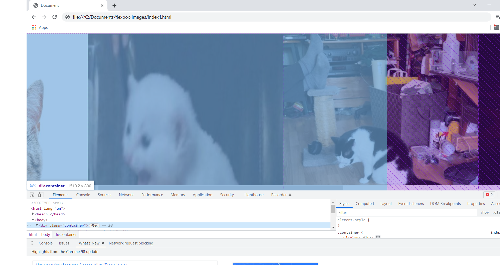
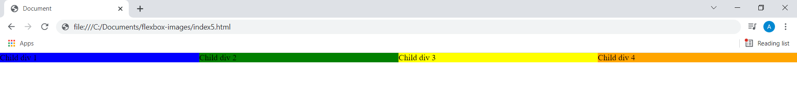

# CSS Flexbox
## Basics and Terminology
- > A **flex container** is the box generated by an element with a computed display of flex or inline-flex. In-flow children of a flex container are called **flex items** and are laid out using the flex layout model.

  [Source](https://www.w3.org/TR/css-flexbox-1/)

- > The main idea behind the flex layout is to give the container the ability to alter its items’ width/height (and order) to best fill the available space (mostly to accommodate to all kind of display devices and screen sizes). A flex container expands items to fill available free space or shrinks them to prevent overflow.
  > (...)
  > Note: Flexbox layout is most appropriate to the components of an application, and small-scale layouts, while the Grid layout is intended for larger scale layouts.

  [Source](https://css-tricks.com/snippets/css/a-guide-to-flexbox/)

### Flex Layout Box Model


*Source: https://www.w3.org/TR/css-flexbox-1/images/flex-direction-terms.svg*

- The **main axis** of a flex container is the primary axis along which flex items are laid out. It extends in the **main dimension**.
- The axis perpendicular to the main axis is called the **cross axis**. It extends in the **cross dimension**.
- The width or height of a flex container or flex item, whichever is in the main dimension, is that box’s **main size**.
- The width or height of a flex container or flex item, whichever is in the cross dimension, is that box’s **cross size**.
- The flex items are placed within the container starting on the **main-start** side and going toward the **main-end** side.
- [Flex lines](#flex-lines) are filled with items and placed into the container starting on the **cross-start** side of the flex container and going toward the **cross-end** side.

[Source](https://www.w3.org/TR/css-flexbox-1/#box-model)

### Flex lines
> Flex items in a flex container are laid out and aligned within flex lines, hypothetical containers used for grouping and alignment by the layout algorithm. A flex container can be either single-line or multi-line, depending on the flex-wrap property (...).

[Source](https://www.w3.org/TR/css-flexbox-1/#flex-line)

## CSS properties
### Flex container properties
- `display`:
  - > defines a flex container; inline or block depending on the given value.

    [Source](https://css-tricks.com/snippets/css/a-guide-to-flexbox/)

  - values:
    - `flex`:
      > The element we've given a   display value of flex to is acting like a block-level element in terms of how it interacts with the rest of the page (...).

      [Source](https://developer.mozilla.org/en-US/docs/Learn/CSS/CSS_layout/Flexbox)
    - `inline-flex`:
      - does not force a new line to begin in the document flow
      - respects `width` and `height` properties values
      - respects `margin` and `padding` and pushes other elements away both horizontally and vertically

- `flex-direction`:
  - > The `flex-direction` property specifies how flex items are placed in the flex container, by setting the direction of the flex container’s main axis.

    [Source](https://www.w3.org/TR/css-flexbox-1/#flex-direction-property)

  - values:
    - `row` (default) - left to right in `ltr`, right to left in `rtl`. See the [note](#css-direction-property) about the `direction` property for more details
    - `row-reverse`
    - `column`
    - `column-reverse`
- `flex-wrap`:
  - > The flex-wrap property controls whether the flex container is single-line or multi-line, and the direction of the cross-axis, which determines the direction new lines are stacked in.

  - values:
    - `nowrap` (default) - the flex container is single-line
    - `wrap` - the flex container is multi-line
    - `wrap-reverse` - the flex container is multi-line; the cross-start and cross-end directions are swapped

     [Source](https://www.w3.org/TR/css-flexbox-1/#valdef-display-inline-flex)
- `flex-flow`:
  - > The `flex-flow` property is a shorthand for setting the `flex-direction` and `flex-wrap` properties, which together define the flex container’s main and cross axes.
    >
    > (...)
    > Note that the `flex-flow` directions are writing mode sensitive. In vertical Japanese, for example, a row flex container lays out its contents from top to bottom (...).

  [Source](https://www.w3.org/TR/css-flexbox-1/#flex-flow-property)

    Defaults to `row nowrap`.

    See the [note](#css-writing-mode-property) about the `writing-mode` property for more details.

- `justify-content`:
  - > defines the alignment along the main axis

  [Source](https://css-tricks.com/snippets/css/a-guide-to-flexbox/)
  - popular values:
    - `normal` (default, according to [W3C specification](https://www.w3.org/TR/css-align-3/#propdef-justify-content))
    - `flex-start` ~~(default)~~:
      >  Aligns the alignment subject to be flush with the edge of the alignment container corresponding to the flex container’s main-start or cross-start side, as appropriate.

      [Source](https://www.w3.org/TR/css-align-3/#positional-values)
    - `flex-end`:
      > Aligns the alignment subject to be flush with the edge of the alignment container corresponding to the flex container’s main-end or cross-end side, as appropriate.

      [Source](https://www.w3.org/TR/css-align-3/#positional-values)
    - `center`:
      > Centers the alignment subject within its alignment container.

      [Source](https://www.w3.org/TR/css-align-3/#positional-values)
    - `space-around`:
      > The alignment subjects are distributed so that the spacing between any two adjacent alignment subjects is the same, and the spacing before the first and after the last alignment subject is half the size of the other spacing.
      >
      > 

      [Source](https://www.w3.org/TR/css-align-3/#distribution-values)
    - `space-between`:
      > The first alignment subject is placed flush with the start edge of the alignment container, the last alignment subject is placed flush with the end edge of the alignment container, and the remaining alignment subjects are distributed so that the spacing between any two adjacent alignment subjects is the same.
      >
      > 

      [Source](https://www.w3.org/TR/css-align-3/#distribution-values)
    - `space-evenly`:
      > The alignment subjects are distributed so that the spacing between any two adjacent alignment subjects, before the first alignment subject, and after the last alignment subject is the same.
      >
      > 

      [Source](https://www.w3.org/TR/css-align-3/#distribution-values)

  - > There are also two additional keywords you can pair with these values: safe and unsafe. Using safe ensures that however you do this type of positioning, you can’t push an element such that it renders off-screen (e.g. off the top) in such a way the content can’t be scrolled too (called "data loss").

    [Source](https://css-tricks.com/snippets/css/a-guide-to-flexbox/)

    This two keywords are currently (22.11.2020) not supported anywhere except for Firefox:
    
  *Source: https://caniuse.com/?search=flex%20safe*
- `justify-items`:
  > In flexbox layouts, this property is *ignored*

  [Source](https://developer.mozilla.org/en-US/docs/Web/CSS/justify-items)
- `align-items`:
  - > This defines the default behavior for how flex items are laid out along the cross axis on the current line.

    [Source](https://css-tricks.com/snippets/css/a-guide-to-flexbox/)

  - > `align-items` sets the default alignment for all of the flex container’s items (...). `align-self` allows this default alignment to be overridden for individual flex items.

    [Source](https://www.w3.org/TR/css-flexbox-1/#align-items-property)

    

  *Source: https://www.w3.org/TR/css-flexbox-1/images/flex-align.svg*
  - values:
    - `normal` (default, according to [W3C specification](https://www.w3.org/TR/css-align-3/#align-items-property)) -
    > The effect of this keyword is dependent of the layout mode we are in (...). For flex items, the keyword behaves as `stretch`.

    [Source](https://developer.mozilla.org/en-US/docs/Web/CSS/align-items)
    - `stretch` ~~(default)~~
    - `flex-start`
    - `flex-end`
    - `center`
    - `baseline` -
      > In many cases, when the font size is the same among items (...), or the content is otherwise the same, then flex-start and baseline will be indistinguishable.
      >
      > But if content size varies among flex items, then baseline can make a noticeable difference.

      [Source](https://stackoverflow.com/questions/34606879/whats-the-difference-between-flex-start-and-baseline)

      

- `align-content`
   - > The align-content property aligns a flex container’s lines within the flex container when there is extra space in the cross-axis, similar to how justify-content aligns individual items within the main-axis. Note, this property has no effect on a single-line flex container

   [Source](https://www.w3.org/TR/css-flexbox-1/#align-items-property)

   
*Source: https://css-tricks.com/wp-content/uploads/2018/10/align-content.svg*

  - values:
    - `normal` (default, according to [W3C specification](https://www.w3.org/TR/css-align-3/#align-justify-content))
    - `stretch`:
      - > Lines stretch to take up the remaining space. If the leftover free-space is negative, this value is identical to flex-start. Otherwise, the free-space is split equally between all of the lines, increasing their cross size.

      [Source](https://www.w3.org/TR/css-flexbox-1/#align-items-property)
      - see also [align-content: normal vs stretch](#align-content-normal-vs-stretch)
    - `flex-start`
    - `flex-end`
    - `center`
    - `space-between`
    - `space-around`
    - `space-evenly`
### Flex items properties
- `order`:
  - > Flex items are, by default, displayed and laid out in the same order as they appear in the source document. The order property can be used to change this ordering.
    >
    > (...)
    >  It takes a single \<integer\> value, which specifies which ordinal group the flex item belongs to.
    >
    > A flex container lays out its content in order-modified document order, starting from the lowest numbered ordinal group and going up. Items with the same ordinal group are laid out in the order they appear in the source document.

    [Source](https://www.w3.org/TR/css-flexbox-1/#order-property)

  - default value: 0

  - a note on accessibility:
    > The order property does not affect ordering in non-visual media (such as speech). Likewise, order does not affect the default traversal order of sequential navigation modes (such as cycling through links, see e.g. tabindex)

    [Source](https://www.w3.org/TR/css-flexbox-1/#order-accessibility)

  - example use case:
    > You might have a design, perhaps a card that will display a news item. The heading of the news item is the key thing to highlight and would be the element that a user might jump to if they were tabbing between headings to find content they wanted to read. The card also has a date;
    > (...)
    > Visually the date appears above the heading, in the source. However, if the card was read out by a screen reader I would prefer that the title was announced first and then the publication date.

    [Source](https://developer.mozilla.org/en-US/docs/Web/CSS/CSS_Flexible_Box_Layout/Ordering_Flex_Items)
- `flex-grow`:
  - > The flex-grow property sets the flex grow factor to the provided \<number\>. Negative numbers are invalid.

    [Source](https://www.w3.org/TR/css-flexbox-1/#propdef-flex-grow)

  - **flex grow factor** -  determines how much the flex item will grow relative to the rest of the flex items in the flex container when positive free space is distributed.

    [Source](https://www.w3.org/TR/css-flexbox-1/#flex-flex-grow-factor)

  - default value: 0

  - > If we have more than one element in a line (row or column) that has a flex-grow value, these elements will share the available space. The total number of flex-grow values will be added up to create the "full pie" — stay with me here. Let’s say we have two elements next to one another. One element has a flex-grow of 2, and the other has a flex-grow of 1. The total number of flex-grow units will be 3. The available space in the flex container is then going to be divided by 3, and distributed accordingly. The first item (flex-grow:2;) will get 2 pieces of the available space, and the second item (flex-grow:1;) will get 1 piece of the available space.

    [Source](https://medium.com/@tiffnogueira/understanding-flex-shrink-flex-grow-and-flex-basis-and-using-these-properties-to-their-full-e4b4afd2c930)

  - example:

    ```html
    <!DOCTYPE html>
    <html lang="en">

    <head>
      <meta charset="UTF-8">
      <meta name="viewport" content="width=device-width, initial-scale=1.0">
      <title>Document</title>
      <style>
        .container {
          background-color: green;
          display: flex;
          height: 50px;
          margin-bottom: 15px;
        }

        .container :first-child {
          background-color: red;
        }

        .container :nth-child(2) {
          background-color: orange;
        }

        .container :last-child {
          background-color: yellow;
        }

        .grow :first-child {
          flex-grow: 1;
        }

        .grow :last-child {
          flex-grow: 2;
        }
      </style>
    </head>

    <body>
      <div class="container">
        <div>Content</div>
        <div>Content</div>
        <div>Content</div>
      </div>

      <div class="container grow">
        <div>Content</div>
        <div>Content</div>
        <div>Content</div>
      </div>
    </body>

    </html>
    ```

    
- `flex-shrink`:
  - > The flex-shrink property sets the flex shrink factor to the provided \<number\>. Negative numbers are invalid.

    [Source](https://www.w3.org/TR/css-flexbox-1/#flex-shrink-property)

  - **flex shrink factor** - determines how much the flex item will shrink relative to the rest of the flex items in the flex container when negative free space is distributed.

    [Source](https://www.w3.org/TR/css-flexbox-1/#flex-flex-shrink-factor)

  - default value: 1

  - > In use, flex-shrink is used alongside the other flex properties flex-grow and flex-basis, and normally defined using the flex shorthand.

    [Source](https://developer.mozilla.org/en-US/docs/Web/CSS/flex-shrink)

  - example:

    ```html
    <!DOCTYPE html>
    <html lang="en">

    <head>
      <meta charset="UTF-8">
      <meta name="viewport" content="width=device-width, initial-scale=1.0">
      <title>Document</title>
      <style>
        .child {
          width: 200px;
        }

        .container {
          background-color: green;
          display: flex;
          height: 50px;
          margin-bottom: 15px;
        }

        .shrink {
          max-width: 500px;
        }

        .container :first-child {
          background-color: red;
          flex-shrink: 0;
        }

        .container :nth-child(2) {
          background-color: orange;
        }

        .container :last-child {
          background-color: yellow;
          flex-shrink: 3
        }
      </style>
    </head>

    <body>
      <div class="container">
        <div class="child">Content</div>
        <div class="child">Content</div>
        <div class="child">Content</div>
      </div>

      <div class="container shrink">
        <div class="child">Content</div>
        <div class="child">Content</div>
        <div class="child">Content</div>
      </div>
    </body>

    </html>
    ```

    
- `flex-basis`:
  - > specifies the initial size of the flex item, before any available space is distributed according to the flex factors.

    [Source](https://css-tricks.com/almanac/properties/f/flex-basis/)

  - controls flex item's width if flex container's `flex-direction` is set to `row`; controls flex item's height if flex container's `flex-direction` is set to `column`.

  - default value: `auto`:
    > When specified on a flex item, the `auto` keyword retrieves the value of the main size property as the used `flex-basis`. If that value is itself `auto`, then the used value is `content`.

    [Source](https://www.w3.org/TR/css-flexbox-1/#valdef-flex-basis-auto)

  - > Note: in case both `flex-basis` (other than `auto`) and `width` (or `height` in case of `flex-direction: column`) are set for an element, `flex-basis` has priority.

    [Source](https://developer.mozilla.org/en-US/docs/Web/CSS/flex-basis)

  - you can read more in [The difference between width and flex-basis in Flexbox](https://www.freecodecamp.org/news/flexboxs-flex-basis-explained-83d1a01413b7/)
- `flex`:
  - > This is the shorthand for `flex-grow`, `flex-shrink` and `flex-basis` combined. The second and third parameters (`flex-shrink` and `flex-basis`) are optional.

    [Source](https://css-tricks.com/snippets/css/a-guide-to-flexbox/)
  - default value: `0 1 auto`

  - >Authors are encouraged to control flexibility using the flex shorthand rather than with flex-grow directly, as the shorthand correctly resets any unspecified components to accommodate common uses.

    [Source](https://drafts.csswg.org/css-flexbox/#flex-grow-property)
- `align-self`:
  - > This allows the default alignment (or the one specified by align-items) to be overridden for individual flex items.

  [Source](https://css-tricks.com/snippets/css/a-guide-to-flexbox/)

  - values:
    - `auto` (default) - computes to the parent's align-items value. [Source](https://developer.mozilla.org/en-US/docs/Web/CSS/align-self)
    - `flex-start`
    - `flex-end`
    - `center`
    - `baseline`
    - `stretch`
---
## Notes
### CSS `direction` property
> The `direction` CSS property sets the direction of text, table columns, and horizontal overflow. Use `rtl` for languages written from right to left (like Hebrew or Arabic), and `ltr` for those written from left to right (like English and most other languages).
  >
  > (...)
  >
  > Note that text direction is usually defined within a document (e.g., with HTML's `dir` attribute) rather than through direct use of the direction property.

  [Source](https://developer.mozilla.org/en-US/docs/Web/CSS/direction)

  Example:
  ```html
  <html class="language-ar ua-chrome ua-chrome-86 ua-vn- dev-desktop os-windows user-location-pl" dir="rtl" lang="ar" data-status-code="200" data-triggered="true">
    ...
  </html>
  ```
  [Source: Arabic edition of Goal.com](https://www.goal.com/ar)

### CSS `writing-mode` property
> This property specifies the block flow direction, which is the direction in which block-level containers are stacked, and the direction in which inline-level content flows within a block container.

  [Source](https://developer.mozilla.org/en-US/docs/Web/CSS/writing-mode)

  Values:
  - `horizontal-tb` - default
  - `vertical-rl`
  - `vertical-lr`
  - `sideways-rl` - experimental
  - `sideways-lr` - experimental

### `align-content`: `normal` vs `stretch`

> (...) the spec writers of the CSS Flexbox Level 1 spec invented new alignment and distribution properties, justify-content, align-content, align-items and align-self. The value of align-content that was judged most useful as a default for flexbox was stretch, so that was made the initial value.
>
> But following not far behind flexbox was the Grid layout Level 1 spec. It made no sense to invent yet another set of alignment properties for that, so the flexbox ones got reused. Additionally, there is a desire to fix the limitation of the 2.x alignment capabilities by applying these to older layout models like the block and columnar models. Which means that having the definition of the properties in the Flexbox spec was out-of-place.
>
> So they're being moved to the CSS Box Alignment spec.
>
> In the case of Grid layouts, align-content:stretch is still a good initial value choice. But if it was chosen as an initial value for block layouts, its defined behaviour would be incompatible will what web pages do today. To get around that, the initial value is redefined there to be normal, which can be interpreted as "whatever web pages do today in all contexts".
>
> So then, it defines the behaviour for align-content:normal for Flex layouts to be the same as align-content:stretch giving it perfect backward compatibility with the FlexBox spec. It defines align-content:normal the same for Grid layouts. For other layouts though, it defines the behaviour differently, such that it's compatible with how those layouts work today.

[Source](https://stackoverflow.com/questions/64102949/initial-value-of-align-content)

### Images as flex items
When a flex container contains [replaced elements](https://developer.mozilla.org/en-US/docs/Web/CSS/Replaced_element), e.g. images, as its direct children, we may encounter some issues with styling. Consider the following example (the images come from https://cataas.com/#/):
```html
<!DOCTYPE html>
<html lang="en">

<head>
  <meta charset="UTF-8">
  <meta http-equiv="X-UA-Compatible" content="IE=edge">
  <meta name="viewport" content="width=device-width, initial-scale=1.0">
  <title>Document</title>
  <style>
    body {
      margin: 0;
    }

    .container {
      display: flex;
    }

    .container img {
      flex: 1 1 0;
    }
  </style>
</head>

<body>
  <div class="container">
    
    
    
    
    
  </div>
</body>

</html>
```

Since we set `flex: 1 1 0;` on the `` elements, we could expect them to shrink in order to fit in the container, which by default occupies the entire horizontal space available, so the whole viewport width in this example. As a result, we could expect the images to be resized to take up 100% of viewport width - but not more - horizontally, like this:



But instead, they take up additional horizontal space, making a horizontal scrollbar appear:


even though the container itself doesn't stretch:



For a similar setup, but with `<div>` elements as flex items instead of images, we don't have this problem:
```html
<!DOCTYPE html>
<html lang="en">

<head>
  <meta charset="UTF-8">
  <meta http-equiv="X-UA-Compatible" content="IE=edge">
  <meta name="viewport" content="width=device-width, initial-scale=1.0">
  <title>Document</title>
  <style>
    body {
      margin: 0;
    }

    .container {
      display: flex;
      width: 100%;
    }

    .container div {
      flex: 1 1 0;
    }
  </style>
</head>

<body>
  <div class="container">
    <div style="background-color: blue;">Child div 1</div>
    <div style="background-color: green;">Child div 2</div>
    <div style="background-color: yellow;">Child div 3</div>
    <div style="background-color: orange;">Child div 4</div>
  </div>
</body>

</html>
```



Why does it work differently for images then? As mentioned in the beginning, `` elements are so called [replaced elements](https://developer.mozilla.org/en-US/docs/Web/CSS/Replaced_element) and their default size depends on their content, so, in this case, on the cat pictures dimensions. Since each cat picture is 600px wide, their combined width exceeds viewport width and they overflow their container. In order to fix this, we could explicitly allow them to have a width smaller than their content's width with `min-width: 0`:
```css
.container img {
  flex: 1 1 0;
  min-width: 0;
}
```
and now the images should be resized to fit in their container:


As we've already learned in the [Flex container properties](#flex-container-properties) section, the default value of the `align-items` property of the flex container is set to `normal`, which is functionally equivalent to `stretch`. If we want to preserve aspect ratio of our images, we can set `align-items` on the container e.g. to `center` or `flex-start`, depending on our needs.
