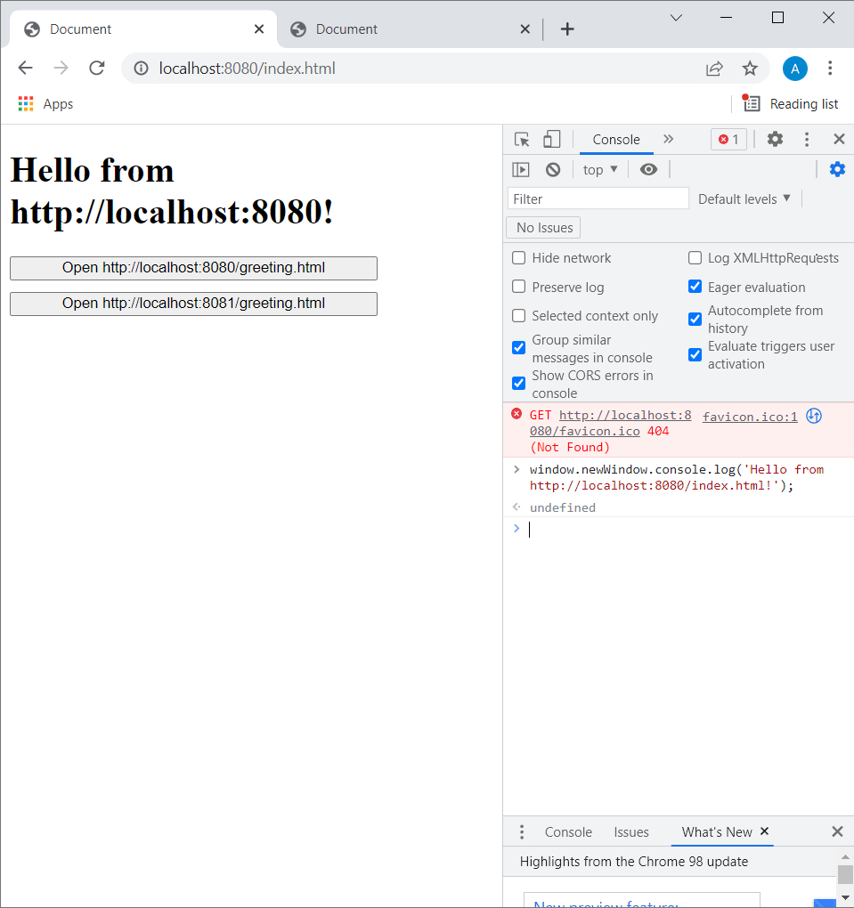
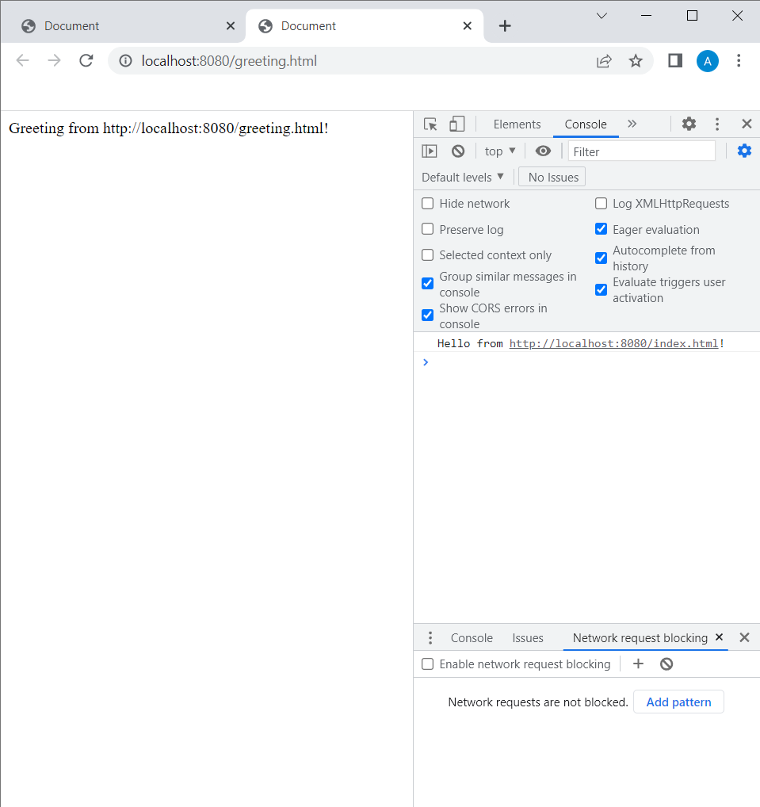
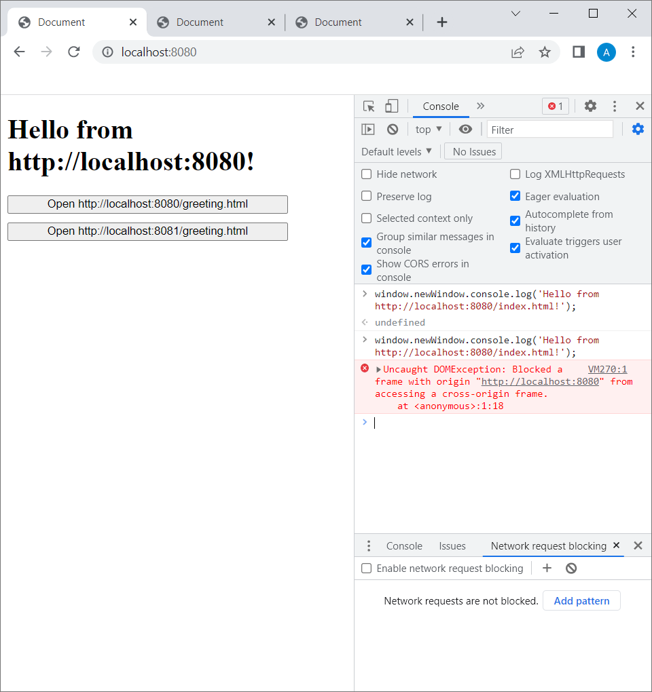

# Same-origin policy (SOP)

> The same-origin policy is a critical security mechanism that restricts how a document or script loaded by one origin can interact with a resource from another origin.

[Source](https://developer.mozilla.org/en-US/docs/Web/Security/Same-origin_policy)

## Overview

- a script can read only the properties of windows and documents that have the same origin as the document that contains the script
-  origin of a document is defined as the **protocol**, **host**, and **port** of the URL from which the document was loaded
- it is important to understand that the origin of the script itself is not relevant to the same-origin policy: what matters is the origin of the document in which the script is embedded
- if your script opened a window (from a different origin), your script can close it, but it cannot "look inside" the window in any way.
- The same-origin policy also applies to scripted HTTP requests made with `XMLHttpRequest` or `fetch`

Source: *JavaScript: The Definitive Guide*, 6th Edition, David Flanagan, Chapter 13: JavaScript in Web Browsers, p. 334

All of the examples below were tested in Chrome, but any browser with developer tools that let users inspect network traffic should work.

## Example 1 - accessing a cross-origin frame with `window.open`
In `section_6_same_origin_policy\examples\window-open` you can find two directories: `origin1` and `origin2`. In `section_6_same_origin_policy\examples`, there is a `package.json` file containig two scripts:
- `start:window-open:origin1` - which starts a simple HTTP server that serves files from the `origin1` directory on port 8080,
- `start:window-open:origin2` - which starts a simple HTTP server that serves files from the `origin2` directory on port 8081.

In your terminal, navigate to the `section_6_same_origin_policy\examples` directory and run `npm install` to install `http-server`. Then run `npm run start:window-open:origin1` to start the first server, open a new terminal window, navigate to `section_6_same_origin_policy\examples` there as well and run `npm run start:window-open:origin2` to start the second server.

Next, navigate to http://localhost:8080/index.html. You will see a heading saying *Hello from http://localhost:8080!* and two buttons: `Open http://localhost:8080/greeting.html` and `Open http://localhost:8081/greeting.html`. When you click the first one, a new window will open with a message: *Greeting from http://localhost:8080/greeting.html!*. When you click the second one, another window will be opened, but with no greeting message this time.

Now let's analyze the code. In `section_6_same_origin_policy\examples\window-open\origin1\index.html`, we have an `h1` heading and the two buttons mentioned earlier:
```html
  <h1 id="hello-container"></h1>
  <div id="buttons-container">
    <button id="open-8080">Open http://localhost:8080/greeting.html</button>
    <button id="open-8081">Open http://localhost:8081/greeting.html</button>
  </div>
```

There's also a script tag pointing to a JS file served from `origin2`:
```html
  <script src="http://localhost:8081/main.js"></script>
```

This script file is responsible for filling the heading with *Hello from http://localhost:8080!* and for handling the buttons' click events. If you take a look at the source code in `section_6_same_origin_policy\examples\window-open\origin2\main.js`, you will see that when one of the buttons is clicked, the following happens:
- the respective URL (http://localhost:8080/greeting.html or http://localhost:8081/greeting.html) is opened is a new tab,
- the script attempts to access the DOM of the page is has just opened in order to display the greeting.

Accessing the DOM (and therefore displaying the greeting) works for http://localhost:8080/greeting.html, but not for http://localhost:8081/greeting.html.

Additionally, after one of the buttons is clicked, the new window object returned by `window.open(url)` is saved as `window.newWindow` at
http://localhost:8080/index.html. To be more precise, the object returned is a `WindowProxy` object:
> ### Return value
>
> A `WindowProxy` object, which is basically a thin wrapper for the `Window` object representing the newly created window, and has all its features available. If the window couldn't be opened, the returned value is instead `null`. The returned reference can be used to access properties and methods of the new window as long as it complies with Same-origin policy security requirements.

[Source](https://developer.mozilla.org/en-US/docs/Web/API/Window/open#return_value)

You can click the first button, wait for a new tab to open and then navigate back to http://localhost:8080/index.html, open the console and try to play with `window.newWindow` in there. For example, you can use its `console.log` function like this:
```javascript
window.newWindow.console.log('Hello from http://localhost:8080/index.html!');
```
to display something in the console at http://localhost:8080/greeting.html:





Now try to do the same thing after clicking the second button and you should see the following error:

```
Uncaught DOMException: Blocked a frame with origin "http://localhost:8080" from accessing a cross-origin frame.
```



This example proves that it's not the origin of the script itself (http://localhost:8081/main.js) that matters, but the origin of the page in which it is embedded (http://localhost:8080/index.html).

## Example 2 - accessing cross-origin data with `fetch`

In your terminal, navigate to the `section_6_same_origin_policy\examples` directory and run `npm install`, if you haven't already. There are three more scripts in `package.json` that we haven't run yet:
- `start:fetch:origin1` - which starts a simple HTTP server that serves files from the `fetch\origin1` directory on port 8080,
- `start:fetch:origin2` - which starts a simple HTTP server that serves files from the `fetch\origin2` directory on port 8081,
- `start:fetch-with-cors:origin2` - which also starts a server that serves files from `fetch\origin2` on port 8081, but with a `cors` option.

First make sure that the servers from the previous example are no longer running and then execute `npm run start:fetch:origin2` in one terminal window and `npm run start:fetch:origin1` in another.

Now navigate to http://localhost:8080/index.html in your browser. You should see a simple page with two buttons: `Fetch pandas from http://localhost:8080` and `Fetch pandas from http://localhost:8081`. Open dev tools and go to JavaScript console. Click the first button. You should see an array of three objects describing pandas. When you click the second button, you should see the following error in the console:

> Access to fetch at 'http://localhost:8081/pandas.json' from origin 'http://localhost:8080' has been blocked by CORS policy: No 'Access-Control-Allow-Origin' header is present on the requested resource. If an opaque response serves your needs, set the request's mode to 'no-cors' to fetch the resource with CORS disabled.

Let's take a look at the code. In `section_6_same_origin_policy\examples\fetch\origin1\index.html`, there is a `script` element loading a script from `origin2`:
```html
<script src="http://localhost:8081/main.js"></script>
```
We can find the source code of this script in `section_6_same_origin_policy\examples\fetch\origin2\main.js`. What it does is it attaches click handlers to both buttons. The handlers are supposed to fetch a `pandas.json` file from a proper origin (http://localhost:8080 for the first button and http://localhost:8081 for the second one).

Indeed, there are two identical `panda.json` files served by both servers. You can visit http://localhost:8080/pandas.json and http://localhost:8081/pandas.json to see their content.

The `fetch` call in `http://localhost:8081/main.js` successfully returns the data from http://localhost:8080/pandas.json, but the attempt to fetch it from http://localhost:8081/pandas.json results in the error we saw above. Similarly to the first example, this shows that it's the origin of the document where the script is embedded (http://localhost:8080/index.html in this case), and not the script itself, that determines what origins we are allowed to fetch data from.

To fix the problem, stop the server you started with `npm run start:fetch:origin2` and then start it again, but this time using the `npm run start:fetch-with-cors:origin2` command. When it's up and running, go to http://localhost:8080/index.html and click the second button once again. With the `cors` option enabled, our pandas data should be successfully logged to the console.

But how did adding `--cors` fix the problem?

### CORS

CORS stands for *Cross-Origin Resource Sharing* and is
>  an HTTP-header based mechanism that allows a server to indicate any origins (domain, scheme, or port) other than its own from which a browser should permit loading resources.

[Source](https://developer.mozilla.org/en-US/docs/Web/HTTP/Headers/Access-Control-Allow-Origin)

Open the *Network* tab in dev tools and find the request to http://localhost:8081/pandas.json. Among the response headers, you should see one named `Access-Control-Allow-Origin` with a value set to `*`. This header
> indicates whether the response can be shared with requesting code from the given origin.

[Source](https://developer.mozilla.org/en-US/docs/Web/HTTP/Headers/Access-Control-Allow-Origin)

And the `*` value
> tells browsers to allow requesting code from any origin to access the resource

[Source](https://developer.mozilla.org/en-US/docs/Web/HTTP/Headers/Access-Control-Allow-Origin)

You can check that the header is not present when the server from `origin2` is started without the `cors` option and, as a result, the `fetch` call fails.

## The purpose of the same-origin policy
You may wonder how the same-origin policy protects users from attacks in the second example. Clicking the second button at http://localhost:8080/ causes an error:
> Access to fetch at 'http://localhost:8081/pandas.json' from origin 'http://localhost:8080' has been blocked by CORS policy: No 'Access-Control-Allow-Origin' header is present on the requested resource.

and the data from http://localhost:8081/pandas.json is not logged to the console. However, if we navigate to http://localhost:8081/pandas.json directly in a new browser tab, the browser will send a GET request that will be responded with a status code of `200 OK` (you can check it in the *Network* tab in dev tools) and our JSON file with pandas data will be displayed. The data would also be successfully returned if we sent a request with a tool like `curl` or Postman, instead of a browser.

Moreover, if we once again run the server from `origin2` without the `cors` option, go back to http://localhost:8080/ and observe the *Network* tab while clicking the second button, we can see that the request is actually sent to the server, which responds with a status code 200. The response is just prevented from being read on client side. Why is that?

The same-origin policy is a mechanism specific to browsers, and that's because browsers do something that tools like `curl` or Postman don't: they send cookies tied to a specific domain with all requests to that domain, regardless of where these requests come from.

Imagine that we have a service, available at some URL endpoint, that returns some secret data in a response to GET requests that contain proper authentication cookies. Imagine that there's also a malicious website that performs a [Cross Site Request Forgery (CSRF)](https://owasp.org/www-community/attacks/csrf) attack - it tricks a user to send a request to our URL. If the user is already logged to our service and has the authentication cookie saved, the cookie will be sent with the request and, as a result, our URL will return the secret data.

Since all of this happens on the user's machine, for the attack to be successful, the data would need to be sent to the attacker. But it can't, bacause the same-origin policy would block it from being read!

You can read more about SOP and its importance in [this](https://sekurak.pl/czym-jest-cors-cross-origin-resource-sharing-i-jak-wplywa-na-bezpieczenstwo/) article (in Polish).