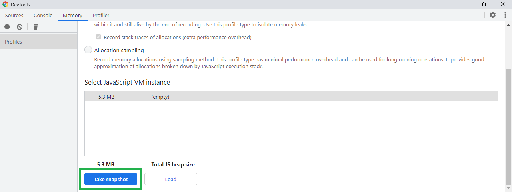
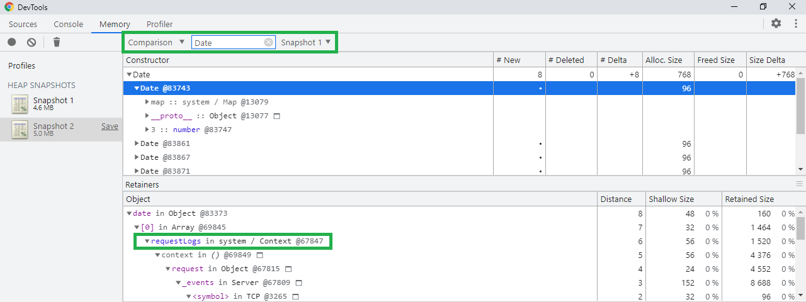
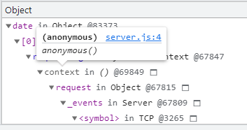

# Debugging Node.js memory leaks with Chrome DevTools

This section is based on the article [Finding And Fixing Node.js Memory Leaks: A Practical Guide](https://marmelab.com/blog/2018/04/03/how-to-track-and-fix-memory-leak-with-nodejs.html) by Kévin Maschtaler.

## Project description

There is a very simple HTTP server defined in `section_7/src/server.js`. It listens for requests on port 3000. Upon receiving a request, it does two things:

- it creates an object containing request details (its URL, HTTP method and date) and pushes it to an array called `requestLogs`,
- it returns the stringified `requestLogs` array as a response.

This way, the `requestLogs` array contains more and more elements with every request until the server is restarted.

## How to run it

In order to run the project, you have to:

- go to the `section_7` directory:

```
$ cd section_7
```

- install dependencies:

```
$ npm install
```

- start the server:

```
$ npm start
```

You should see a message: _Server is running on port 3000_ in the console. Now, when you navigate to http://localhost:3000/ in a browser of your choice, you should see a response similar to the one below:

```
[{"url":"/","method":"GET","date":"2021-06-19T09:57:06.444Z"}]
```

Every time you reload the page, the array in the response will contain two more elements (see [Note: Sending GET requests from a browser](#note-sending-get-requests-from-a-browser), to find out why there are two of them).

You can also send a request with a different HTTP method, e.g. POST, using a tool like `curl` or Postman. With `curl` you can do it like this:

```
$ curl -X POST http://localhost:3000
[{"url":"/","method":"POST","date":"2021-06-19T10:00:54.114Z"}]
```

## Memory leak detection

As you can see, the `requestLogs` array gets bigger and bigger with every request. The memory allocated to the objects it contains is never freed up without restarting the server. The application is simple enough to identify the reason of this memory leak by analysing the code, but what if it was more complicated? Fortunately, there are tools that can help us with this task, Chrome DevTools being one of them. You can see how to use them by following the instructions below:

- Start the server again, this time by running the `start:inspect` script:

```
npm run start:inspect
```

This command runs our app with the `--inspect` flag, which makes the Node.js process listen for a debugging client. You can find more information about it [here](https://nodejs.org/en/docs/guides/debugging-getting-started/).

You should see a result similar to the one below:

```
Debugger listening on ws://127.0.0.1:9229/da1e39bc-52fe-4364-a7d4-f3b1164ce325
For help, see: https://nodejs.org/en/docs/inspector
Server is running on port 3000
```

- Visit `chrome://inspect/#devices` address in Chrome. In the Devices section, you should see our app listed (you may need to wait for a while before it appears):


- Click on *inspect*. It will open a new DevTools window. In this new window, select the *Memory* tab, and then click the *Take snapshot* button:



- Now send a few (let's say 8) requests to the server. You can do it with `curl` like this:
```
$ curl -X GET http://localhost:3000
```
- Go back to the *Memory* tab and take another snapshot. When it's ready, compare how many `Date` objects have been allocated between Snapshot 1 and Snapshot 2:



You can see that 8 new `Date` objects have been created between the snapshots, which matches the number of requests sent. In the details below, you can see that these objects come from the `requestLogs` array. You can even see the name of the file where they're defined:



In more complex apps, it can be useful for identifying the source of ever-growing memory usage.

---
### Note: Sending GET requests from a browser

If you use a browser, instead of `curl`, to send requests to the server, you may notice that there are twice as many `Date` objects created as there were times you reloaded the page. The reason is that browsers send an additional request to http://localhost:3000/favicon.ico along with every request to http://localhost:3000.

---

## How to automate test requests

Sending requests to the server manually can be cumbersome, especially if we need a huge number of them. Instead, we can use a library, like [loadtest](https://github.com/alexfernandez/loadtest), to automate the process. For this we need to perform the following steps:

- install `loadtest` globally:
```
npm install -g loadtest
```
- run it, specifying the number of requests with `-n` option, and the URL to send them to:
```
loadtest -n 125 http://localhost:3000
```
When the task is finished, in the result you should see the number of requests sent:
```
[Sun Jun 20 2021 10:02:08 GMT+0200 (Central European Summer Time)] INFO Completed requests:  125
```

Sources:

- _Finding And Fixing Node.js Memory Leaks: A Practical Guide_, https://marmelab.com/blog/2018/04/03/how-to-track-and-fix-memory-leak-with-nodejs.html
- _loadtest_, https://github.com/alexfernandez/loadtest
