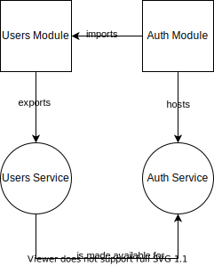

# NestJS overview

## Dependency injection
> Dependency injection, or DI, is a design pattern in which a class requests dependencies from external sources rather than creating them.

[Source](https://angular.io/guide/dependency-injection)

> Dependency Injection (DI) is a programming technique that makes a class independent of its dependencies. Creating objects directly within the class is inflexible because it commits the class to particular objects and makes it impossible to change the instantiation later independently from the class.

[Source](https://www.growin.com/blog/what-is-dependency-injection/)

An example controller without dependency injection pattern implemented: https://github.com/productioncoder/node-dependency-injection/blob/starter/controller/dev.js

The same controller with dependency injection: 
https://github.com/productioncoder/node-dependency-injection/blob/master/controller/dev.js

Watch [Dependency Injection in Node with awilix #1](https://youtu.be/TxxdqfhMUnI?t=383) for more details.

### IoC Container
> The Container creates an object of the specified class and also injects all the dependency objects through a constructor, a property, or a method at run time and disposes it at the appropriate time. This is done so that we don't have to create and manage objects manually.

[Source](https://www.growin.com/blog/what-is-dependency-injection/)

One of the advantages of using dependency injection is that we can easily replace dependencies with their mocks:
```typescript
const mockRegionServiceProvider = {
  provide: RegionService,
  useValue: {
    find: jest.fn().mockReturnValue(Promise.resolve(mockRegion)),
    findAll: jest.fn().mockReturnValue(Promise.resolve(mockRegions)),
  },
};
```
(though it is still possible go mock dependencies in tests, even if they're created directly in a class, e.g. with [`jest.mock`](https://jestjs.io/docs/manual-mocks#mocking-user-modules)).

## Dependency injection in NestJS

> Dependency injection is an inversion of control (IoC) technique wherein you delegate instantiation of dependencies to the IoC container (in our case, the NestJS runtime system), instead of doing it in your own code imperatively. 

[Source](https://docs.nestjs.com/fundamentals/custom-providers)

## Modules

> A module is a class annotated with a @Module() decorator. The @Module() decorator provides metadata that Nest makes use of to organize the application structure.

[Source](https://docs.nestjs.com/modules)

> Modules define groups of components like providers and controllers that fit together as a modular part of an overall application. They provide an execution context, or scope, for these components. For example, providers defined in a module are visible to other members of the module without the need to export them.

[Source](https://docs.nestjs.com/fundamentals/dynamic-modules)

### Different ways of importing a module
- static module binding

Example:
```typescript
@Module({
  imports: [UsersModule],
  providers: [AuthService],
  exports: [AuthService],
})
```
[Source](https://docs.nestjs.com/fundamentals/dynamic-modules)



> With static module binding, there's no opportunity for the consuming module to influence how providers from the host module are configured.

[Source](https://docs.nestjs.com/fundamentals/dynamic-modules)

- dynamic modules

Example:
```typescript
@Module({
  imports: [ConfigModule.register({ folder: './config' })],
  controllers: [AppController],
  providers: [AppService],
})
```
[Source](https://docs.nestjs.com/fundamentals/dynamic-modules#module-configuration)

Note that the method for providing module's options [can have any arbitrary name, but by convention we should call it either `forRoot()` or `register()`](https://docs.nestjs.com/fundamentals/dynamic-modules#config-module-example). It should return an object of type `DynamicModule`, that can be imported from `@nestjs/common`.

Some modules allow options to be provided asynchronously and define a method called `forRootAsync` for this purpose, e.g. the [TypeOrmModule](https://docs.nestjs.com/techniques/database).

## Providers
> The main idea of a provider is that it can be injected as dependency

[Source](https://docs.nestjs.com/providers)

### Standard providers
The syntax:
```typescript
providers: [AppService],
```
is a short-hand for:
```
providers: [
  {
    provide: AppService,
    useClass: AppService,
  },
];
```
as explained [here](https://docs.nestjs.com/fundamentals/custom-providers#standard-providers).

### Custom providers
Besides the syntax presented above, providers can also be defined with one of the following methods:
- `useValue` - useful e.g. to mock service providers in unit tests:
```typescript
const mockRegionServiceProvider = {
  provide: RegionService,
  useValue: {
    find: jest.fn().mockReturnValue(Promise.resolve(mockRegion)),
    findAll: jest.fn().mockReturnValue(Promise.resolve(mockRegions)),
  },
};
const moduleRef: TestingModule = await Test.createTestingModule({
  providers: [RegionResolver, mockRegionServiceProvider],
})
  .compile();
```
- `useExisting`
- `useFactory` - allows us to define a provider with a factory function, e.g. like this:
```typescript
const connectionFactory = {
  provide: 'CONNECTION',
  useFactory: () => {
    const options = {
      type: 'mysql',
      host: 'localhost',
      port: 3306,
      username: 'root',
      password: 'root',
      database: 'test',
      entities: [],
      synchronize: true,
    };
    return new DatabaseConnection(options);
  }
};
```
 The factory function can depend on other providers. If that's the case, it can accept these providers are parameters. The values of these parameters should be defined in an array  assigned to a property called `inject`, that is defined in the provider object at the same level as the factory function itself, e.g.:
 ```typescript
 const connectionFactory = {
  provide: 'CONNECTION',
  useFactory: (optionsProvider: OptionsProvider) => {
    const options = optionsProvider.get();
    return new DatabaseConnection(options);
  },
  inject: [OptionsProvider],
};
 ```
[Source](https://docs.nestjs.com/fundamentals/custom-providers#factory-providers-usefactory)


Providers defined with one of these methods are referred to as [custom providers](https://docs.nestjs.com/fundamentals/custom-providers#custom-providers-1).

## Database module integration

> For integrating with SQL and NoSQL databases, Nest provides the `@nestjs/typeorm` package.

[Source](https://docs.nestjs.com/techniques/database)

This package provides a module called `TypeOrmModule`. The module has two methods to configure its options: `forRoot` and `forRootAsync`, for synchronous and asynchronous configuration, respectively. You can read more about modules configuration options in the [Modules](#modules) section.

In order to establish a database connection, we can import the module into the root `AppModule` and provide it with connection options, e.g. like this:
```typescript
@Module({
  imports: [
    TypeOrmModule.forRoot({
      type: 'mysql',
      host: 'localhost',
      port: 3306,
      username: 'root',
      password: 'root',
      database: 'test',
      entities: [],
      synchronize: true,
    }),
  ],
})
export class AppModule {}
```
[Source](https://docs.nestjs.com/techniques/database)

The configuration can also be passed asynchronously, e.g. with a factory function:
```typescript
TypeOrmModule.forRootAsync({
  useFactory: () => ({
    type: 'mysql',
    host: 'localhost',
    port: 3306,
    username: 'root',
    password: 'root',
    database: 'test',
    entities: [__dirname + '/**/*.entity{.ts,.js}'],
    synchronize: true,
  }),
});
```
[Source](https://docs.nestjs.com/techniques/database)

Like mentioned in the *Custom providers* section, factory functions that define providers can also accept a list of parameters. Values for these parameters need to be defined with an `inject` property:
```typescript
TypeOrmModule.forRootAsync({
  useFactory: async (configService: ConfigService) => configService
    .get(CONFIG_TYPE.DATABASE),
  inject: [ConfigService],
});
```

It is also possible to specify a function called `connectionFactory`, that *will allow you to provide your own TypeORM connection rather than allowing TypeOrmModule to create the connection* ([Source](https://docs.nestjs.com/techniques/database#custom-connection-factory)).

> `connectionFactory` receives the TypeORM `ConnectionOptions` configured during async configuration using `useFactory`, `useClass`, or `useExisting` and returns a Promise that resolves a TypeORM Connection.

[Source](https://docs.nestjs.com/techniques/database#custom-connection-factory)


